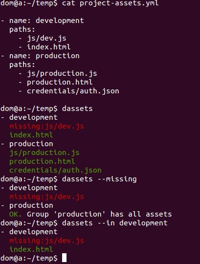

## dassets

Projects deployed across multiple channels often require one-off assets for each channel.  For example, a game could be distributed on a website, on Android, or as a Facebook app.  As the number of distribution channels increases, it becomes difficult to remember which project assets are meant to be copied to which channel.  This command line tool is intended to help organize files and determine if any are missing.

* [Project Goals](#project-goals)
* [Install](#install)
* [project-assets.yml](#project-assets-yml)
* [Command Line Referrence](#command-line-reference)
* [Screenshot](#screenshot)

## Project Goals

1. Define a configuration file for listing project assets and grouping them by channel name.

2. Provide a command line interface that will answer these questions.
  1. What assets are required by a channel?

     `dassets --in [channel name] --in [channel name]`

  2. Do all of the assets exist?  Were some files renamed or deleted?

     `dassets --in [channel name] --missing`

3. Enable installation via a global npm package.

## Install

`npm install -g dassets`

You can also checkout the repo and then run `npm install -g` in the project root.

## project-assets.yml

The project-assets.yml file should contain a list of objects that have "name" and "paths" properties. `name` is a string, and
paths is an array. You can generate a new config file using `dassets --create` or paste the following in project-assets.yml
manually:

```yaml
- name: development
  paths:
    - development.html
- name: production
  paths:
    - production.html
    - credentials/auth.json
```

## Command Line Referrence

```
dassets [-i name] [-m]

Before using, you should create project-assets.yml file in project root and use
command.js anywhere above it.

Options:
--version      Show version number                                   [boolean]
--help         Show help                                             [boolean]
-i, --in       One or more group names to inspect                     [string]
-m, --missing  Show only missing assets                              [boolean]
-c, --create   Create an example project-assets.yml file if one doesn't
               already exist                                         [boolean]

Examples:
dassets                          list all assets in all channels
dassets -m                       show missing assets in all channels
dassets -i production            list all assets in the 'production' channel
dassets -i production -i dev -m  list all missing assets in the
                                 'production' and 'dev' channels
```

## Screenshot


